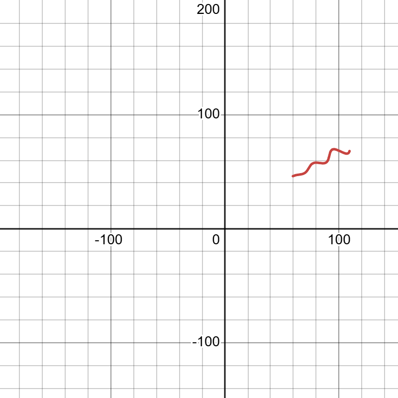

# Parametric Curve Parameter Fitting

This repo solves an assignment where a curve is defined by a parametric
equation with three unknown constants, and we're handed a list of points that
lie on it. The job is to recover those constants.

**Solution code:** [solution.py](https://github.com/NIKHIL-RAJIV/FLAM-Assignment/blob/main/solution.py)

## The Problem

Find the values of unknown variables in the given parametric equation of a
curve:

```
x = ( t·cos(θ) − e^(M|t|)·sin(0.3t)·sin(θ) + X )
y = ( 42 + t·sin(θ) + e^(M|t|)·sin(0.3t)·cos(θ) )
```

Unknowns are:

```
θ, M, X
```

Given range for unknown params is:

```
0 deg < θ < 50 deg
−0.05 < M < 0.05
0 < X < 100
```

Parameter `t` has range:

```
6 < t < 60
```

Given is the list of points that lie on the curve for `6 < t < 60`:
`xy_data.csv`

The CSV contains only the `(x, y)` coordinates — the `t` value behind each
point is not provided.

## How I Approached It

My first instinct was to fit all three unknowns at once by matching each data
point to a value of `t`. But `t` isn't given, so that means fitting `t` for
every point too — messy and unstable. Before writing any code I looked at the
equations more carefully, and there's a much cleaner way in.

Since `6 < t < 60`, the parameter is always positive, so `|t| = t`. Pulling the
constant offsets to the left:

```
x − X = t·cos(θ) − e^(Mt)·sin(0.3t)·sin(θ)
y − 42 = t·sin(θ) + e^(Mt)·sin(0.3t)·cos(θ)
```

Look at the right-hand sides: this is just the point
`( t , e^(Mt)·sin(0.3t) )` rotated by an angle θ and then shifted by
(X, 42). In other words, the complicated-looking curve is a simple signal
that's been rotated and moved. So if I undo the rotation and the shift, it
should fall apart into something trivial.

Rotating the shifted points back by −θ:

```
u = (x − X)·cos(θ) + (y − 42)·sin(θ)
v = −(x − X)·sin(θ) + (y − 42)·cos(θ)
```

When you expand these, every cross term cancels because `sin²θ + cos²θ = 1`,
and you're left with:

```
u = t
v = e^(Mt)·sin(0.3t)
```

That's the whole trick. In the rotated, un-shifted frame the curve is just an
oscillating signal plotted against `t`. Two things fall out of this:

1. I never have to know `t` ahead of time. For the correct `θ` and `X`, the
   value `u` is `t`.
2. The frequency `0.3` inside the sine is fixed — it's not one of the unknowns.
   That locks the phase and means only one `(θ, M, X)` can possibly fit. There
   isn't an ambiguous family of answers.

## The Fit

For any guess of `(θ, M, X)`:

1. Compute `u = (x − X)cos(θ) + (y − 42)sin(θ)` for every point. That's the
   recovered `t`.
2. Compute `v = −(x − X)sin(θ) + (y − 42)cos(θ)`.
3. The error for each point is `v − e^(M·u)·sin(0.3·u)`.

When the guess is right, every error is essentially zero. I minimize the sum of
squared errors using `scipy.optimize.least_squares` with the parameter ranges
from the problem set as hard bounds, so the solver can never step outside the
valid region or let `e^(Mt)` explode. To be safe against local minima, I run
the fit from a grid of starting points across the ranges and keep the best one.

## Result

```
θ = 30°   (0.523599 rad)
M = 0.03
X = 55
```

The fitted curve sits right on top of the data — root-mean-square error of about
`3.5 × 10⁻⁶`, which is basically floating-point noise. The recovered `t` values
run from `6.05` to `60.0`, matching the given range, which is a good sanity
check that nothing is off.



**Desmos plot:** https://www.desmos.com/calculator/9scu5zeqzh

## Running It

```bash
pip install numpy pandas scipy
python solution.py
```

The script checks the CSV columns: if a `t` column happens to be present it
fits the curve directly; otherwise it uses the rotation method above, which
only needs `(x, y)`.

## Submission

Plugging the recovered values into the original equation (θ = 30° = 0.5236 rad),
as a single Desmos parametric tuple `(x(t), y(t))` with `6 ≤ t ≤ 60`:

```
\left(t*\cos(0.5236)-e^{0.03\left|t\right|}\cdot\sin(0.3t)\sin(0.5236)+55,\ 42+t*\sin(0.5236)+e^{0.03\left|t\right|}\cdot\sin(0.3t)\cos(0.5236)\right)
```
